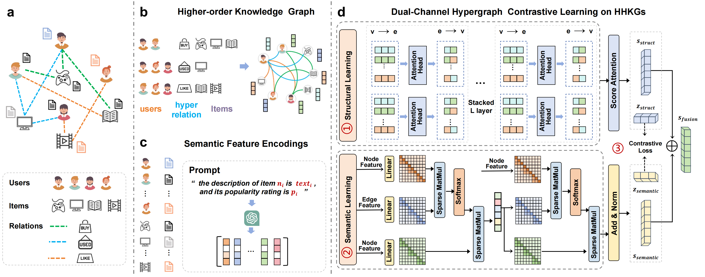

## DualHGNIE: Dual-Channel Hypergraph Learning for Node Importance in Heterogeneous Knowledge Higher-order Graph

Welcome to DualHGNIE's GitHub repository! This repository hosts the code, data and model weight of **DualHGNIE**.

**Abstract**: Node importance estimation (NIE) tasks in heterogeneous knowledge graphs is a fundamental task for applications such as recommendation, knowledge reasoning, and question answering. Existing methods either merge heterogeneous signals into a single representation or separate modalities without effective cross-modal alignment, limiting their ability to capture high-order interactions across multi-entity and multi-relation contexts. To address these challenges, we propose DualHGNIE, a dual-channel hypergraph framework that explicitly disentangles structural and semantic information while integrating them via contrastive learning. DualHGNIE constructs heterogeneous knowledge higher-order graph using meta-path sequences, models multi-entity interactions through typed hyperedges, and employs local attention for structural aggregation alongside a contextual hypergraph transformer for semantic modeling. To reduce the cost of dense attention, we introduce a sparse chunking strategy that eliminates redundant computation without sacrificing expressiveness. Finally, a multimodal fusion module aligns structural and semantic embeddings through contrastive learning, augmented with auxiliary supervision. Experiments on benchmark NIE tasks demonstrate that DualHGNIE achieves state-of-the-art performance, validating the effectiveness of explicit disentanglement and alignment of structural and semantic representations.

<p align="center">

</p>


## 1. Preparation
### 1.1 Environment 

The lightweight training requires torch 2.0+, to install all dependencies , update corresponding libraries: 
```shell
pip install -r requirements.txt
```

### 1.2 Data 
The data can be obtained and downloaded from ([Google Drive](https://drive.google.com/drive/folders/1uhQqAdrIplhhKCHn0McnB-trve6_rATD?usp=drive_link)), and makedir path ```dataset/``` and put dataset in ```dataset/```.

