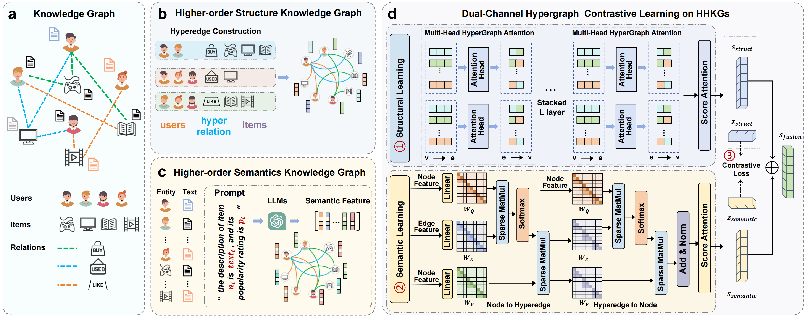

## DualHGNIE: Dual-Channel Hypergraph Learning for Node Importance in Heterogeneous Knowledge Higher-order Graph

Welcome to DualHGNIE's GitHub repository! This repository hosts the code, data and model weight of **DualHGNIE**.

**Abstract**: Node importance estimation (NIE) tasks in heterogeneous knowledge graphs is a fundamental task for applications such as recommendation, knowledge reasoning, and question answering. Existing methods either merge heterogeneous signals into a single representation or separate modalities without effective cross-modal alignment, limiting their ability to capture high-order interactions across multi-entity and multi-relation contexts. To address these challenges, we propose DualHGNIE, a dual-channel hypergraph framework that explicitly disentangles structural and semantic information while integrating them via contrastive learning. DualHGNIE constructs heterogeneous knowledge higher-order graph using meta-path sequences, models multi-entity interactions through typed hyperedges, and employs local attention for structural aggregation alongside a contextual hypergraph transformer for semantic modeling. To reduce the cost of dense attention, we introduce a sparse chunking strategy that eliminates redundant computation without sacrificing expressiveness. Finally, a multimodal fusion module aligns structural and semantic embeddings through contrastive learning, augmented with auxiliary supervision. Experiments on benchmark NIE tasks demonstrate that DualHGNIE achieves state-of-the-art performance, validating the effectiveness of explicit disentanglement and alignment of structural and semantic representations.

<p align="center">

</p>

## 1. Preparation
### 1.1 Environment 

The lightweight training requires torch 2.0+, to install all dependencies , update corresponding libraries: 

```shell
pip install -r requirements.txt
```

### 1.2 Data 

The data can be obtained and downloaded from ([Google Drive](https://drive.google.com/file/d/1OH671dAdRRi2H5rae2bVi0vOkhbFkDcy/view?usp=drive_link)), and makedir path ```dataset/``` and put dataset in ```dataset/```.

### 1.3 Higher-order Relation Construction

Details are in ``` utils.load_data_hypergraph.py ```. We have already constructed the corresponding hyperedge node set and hyperedge type files and saved them in ```dataset/```. Of course, if this folder does not exist, it will be generated (in a few minutes) and saved there.

### 1.4 Semantic Feature Extraction

Call the pre-trained large model ```all-mpnet-base-v2``` to encode semantic information descriptions. Specifically, using MUSIC10K as an example, ```python datasets/MUSIC10K/proposs.py ```


## 2.Main Results Reproduce

### 2.1 Training Preparation

#### 2.1.1 Download datasets and place them under `./dataset`.

#### 2.1.2 Construct heterogeneous high-order hypergraph structures and generate heterogeneous structural hypergraphs and heterogeneous semantic hypergraphs.

#### 2.1.3 Complete list of parameters

| Parameter | Type | Description | Default Value |
| :-------------: |:-------------:| :-------------------------------|:-------------: |
| `dataset` | string | Name of the dataset, options: <br>- `FB15k_rel_two` <br>- `IMDB_S_rel_two` <br>- `TMDB_rel_two` <br>- `MUSIC_rel_two` | `FB15k_rel_two` |
| `data_path` | string | Path of dataset file | `./datasets/fb15k_rel.pk` |
| `gpu` | int | GPU index to use; set `-1` for CPU | `1` |
| `cross-num` | int | Number of cross-validation folds | `3` |
| `epochs` | int | Number of training epochs | `10000` |
| `early-stop` | bool | Whether to use early stopping | `True` |
| `patience` | int | Number of epochs with no improvement before early stopping | `1000` |
| `spm` | bool | Enable SPM mode | `True` |
| `num-heads` | int | Number of hidden attention heads,e.g., 4 8 16 | `4` |
| `num-out-heads` | int | Number of output attention heads | `1` |
| `num-layers` | int | Number of hidden layers | `2` |
| `num-hidden` | int | Number of hidden units | `20` |
| `residual` | bool | Use residual connections | `True` |
| `in-drop` | float | Dropout rate on input features | `0.2` |
| `attn-drop` | float | Dropout rate on attention coefficients | `0.3` |
| `lr` | float | Learning rate | `0.005` |
| `weight-decay` | float | Weight decay (L2 regularization) | `5e-4` |
| `semantic_mode` | string | Semantic encoding mode (e.g., `hyper_transformer`) | `hyper_transformer` |
| `structure_mode` | string | Structure encoding mode (e.g., `hyper_attention`) | `hyper_attention` |
| `contrastive_size` | int | Batch size for contrastive learning | `2000` |
| `fusion_mode` | string | Fusion module between structure and semantic prediction: <br>- `adaptive` <br>- `attention` <br>- `concat` | `adaptive` |
| `eta` | float | Parameter controlling fusion balance between structure and semantic embeddings | `0.2` |
| `chunked_size` | int | Size of sparse chunks for transformer computation | `10000` |
| `alpha` | float | Weight for contrastive learning loss | `0.1` |
| `beta` | float | Weight for unimodal prediction loss | `0.2` |
|

### 2.2 Training DualHGNIE to Demonstrate effevtivenness purpose（Table 1， Table 3, Figure 3）

Run scripts under the folder `./scripts`. For example, to evaluate on four knowledge graphs datasets by:

```shell
sh ./scripts/run_main.sh
```

### 2.3 Training DualHGNIE to Demonstrate Dualchannels Benifits (Table 2)

Run scripts under the folder `./scripts`. For example, to evaluate on four knowledge graphs datasets by:

```shell
sh ./scripts/run_dual.sh
```

### 3. Ablation Study

### 3.1 Contrastive–Unimodal Regularization(w/o).  (Table 4)

Run scripts under the folder `./scripts`.

```shell
sh ./scripts/run_loss.sh
```

### 3.2 Sparse-Chunked Aggregation Mechanism(w/o).  (Table 5, Table C.1)

Run scripts under the folder `./scripts`. and replace the ```SCAHGTLayer``` with ```HGTLayer``` in ```model/DualHGNIE.py```

```shell
sh ./scripts/run_chunk.sh
```

### 3.3 Parameter sensitivity tests and method stability. (Figure 4, Figure 5, Figure 6)

Run scripts under the folder `./scripts`.

```shell
sh ./scripts/run_param.sh
```

### 3.4 Fusion Mechanism between Structure and Semantic Features. (Table B.3)

Run scripts under the folder `./scripts`.

```shell
sh ./scripts/run_fusion.sh
```

